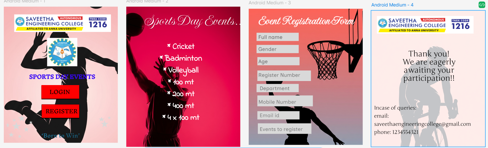

# Ex09 Event Registration Web Application
## Date: 20.05.2025 

## AIM:
To design, develop and deploy a web application for event registration.

## DESIGN STEPS:

### Step 1:
Create a new frame.

### Step 2:
Select any one preset size of your choice.

### Step 3:
Select the shapes you need.

### Step 4:
Import images as needed.

### Step 5:
Create pages based on your need and link them.

### Step 6:

Validate the HTML and CSS code.

### Step 6:

Publish the website in the given URL.

## DESIGN TOOL:
Figma

## CODE:

First page
```
<div class="android-medium-1">
  <div class="chat-gpt-image-may-20-2025-02-10-04-pm-1"></div>
  
  <div class="frame-1">
    
  </div>
  <div class="frame-2">
    
  </div>
  <div class="sports-day-events">SPORTS DAY EVENTS</div>
  <div class="rectangle-1"></div>
  <div class="login">LOGIN</div>
  <div class="rectangle-2"></div>
  <div class="register">REGISTER</div>
  <div class="born-to-win">‘Born to Win’</div>
  
  
  
  
  
  
  
  
  
  
  
</div>
.android-medium-1,
.android-medium-1 * {
  box-sizing: border-box;
}
.android-medium-1 {
  background: #ffffff;
  height: 840px;
  position: relative;
  overflow: hidden;
}
.chat-gpt-image-may-20-2025-02-10-04-pm-1 {
  width: 1225px;
  height: 817px;
  position: absolute;
  left: -492px;
  top: 349px;
  aspect-ratio: 1225/817;
}
.gemini-generated-image-5-ii-8-n-55-ii-8-n-55-ii-8-1 {
  width: 1020px;
  height: 1869px;
  position: absolute;
  left: -129px;
  top: -395px;
  object-fit: cover;
  aspect-ratio: 1020/1869;
}
.frame-1 {
  width: 700px;
  height: 108px;
  position: absolute;
  left: 64px;
  top: 48px;
  overflow: hidden;
}
.image-1 {
  width: 610.63px;
  height: 108px;
  position: absolute;
  left: -17px;
  top: 0px;
  object-fit: cover;
  aspect-ratio: 610.63/108;
}
.frame-2 {
  width: 255px;
  height: 211px;
  position: absolute;
  left: 231px;
  top: 167px;
  overflow: hidden;
}
.image-2 {
  width: 185.44px;
  height: 175px;
  position: absolute;
  left: 35px;
  top: 26px;
  object-fit: cover;
  aspect-ratio: 185.44/175;
}
.sports-day-events {
  color: #3606f8;
  text-align: center;
  font-family: "InknutAntiqua-Regular", sans-serif;
  font-size: 32px;
  font-weight: 400;
  position: absolute;
  left: calc(50% - 217px);
  top: 390px;
  width: 452px;
  height: 59px;
  -webkit-text-stroke: 1px #3606f8;
}
.rectangle-1 {
  background: #ff0000;
  width: 232px;
  height: 84px;
  position: absolute;
  left: 231px;
  top: 484px;
  box-shadow: 0px 4px 4px 0px rgba(0, 0, 0, 1);
}
.login {
  color: #000000;
  text-align: center;
  font-family: "InknutAntiqua-Regular", sans-serif;
  font-size: 32px;
  font-weight: 400;
  position: absolute;
  left: 273px;
  top: 512px;
  width: 141px;
  height: 28px;
  display: flex;
  align-items: center;
  justify-content: center;
}
.rectangle-2 {
  background: #ff0000;
  border-style: solid;
  border-color: #000000;
  border-width: 1px;
  width: 232px;
  height: 84px;
  position: absolute;
  left: 232px;
  top: 603px;
  box-shadow: 0px 4px 4px 0px rgba(0, 0, 0, 1);
}
.register {
  background: linear-gradient(to left, #000000, #000000),
    linear-gradient(to left, #ffffff, #ffffff);
  background-clip: text;
  -webkit-background-clip: text;
  -webkit-text-fill-color: transparent;
  text-align: center;
  font-family: "InknutAntiqua-Regular", sans-serif;
  font-size: 32px;
  font-weight: 400;
  position: absolute;
  left: 237px;
  top: 595px;
  width: 235px;
  height: 100px;
  display: flex;
  align-items: center;
  justify-content: center;
}
.born-to-win {
  background: linear-gradient(
    90deg,
    rgba(34, 139, 184, 1) 0%,
    rgba(20, 82, 109, 1) 99.98999834060669%,
    rgba(15, 62, 82, 1) 100%
  );
  background-clip: text;
  -webkit-background-clip: text;
  -webkit-text-fill-color: transparent;
  text-align: center;
  font-family: "InknutAntiqua-Regular", sans-serif;
  font-size: 32px;
  font-weight: 400;
  position: absolute;
  left: 141px;
  top: 776px;
  width: 416px;
  height: 38px;
  display: flex;
  align-items: center;
  justify-content: center;
}
.star-1 {
  width: 56px;
  height: 52px;
  position: absolute;
  left: 49px;
  top: 712px;
  overflow: visible;
}
.star-2 {
  width: 46px;
  height: 44px;
  position: absolute;
  left: 87px;
  top: 668px;
  overflow: visible;
}
.star-3 {
  width: 26px;
  height: 22px;
  position: absolute;
  left: 51px;
  top: 690px;
  overflow: visible;
}
.star-4 {
  width: 48px;
  height: 50px;
  position: absolute;
  left: 595px;
  top: 700px;
  overflow: visible;
}
.star-5 {
  width: 38px;
  height: 32px;
  position: absolute;
  left: 581px;
  top: 680px;
  overflow: visible;
}
.star-6 {
  width: 21px;
  height: 20px;
  position: absolute;
  left: 637px;
  top: 676px;
  overflow: visible;
}
.star-7 {
  width: 35px;
  height: 36px;
  position: absolute;
  left: 121px;
  top: 740px;
  overflow: visible;
}
.star-8 {
  width: 22px;
  height: 21px;
  position: absolute;
  left: 155px;
  top: 704px;
  overflow: visible;
}
.star-9 {
  width: 25px;
  height: 26px;
  position: absolute;
  left: 85px;
  top: 788px;
  overflow: visible;
}
.star-10 {
  width: 22px;
  height: 33px;
  position: absolute;
  left: 13px;
  top: 715px;
  overflow: visible;
}
.star-11 {
  width: 37px;
  height: 34px;
  position: absolute;
  left: 27px;
  top: 774px;
  overflow: visible;
}
```

Events page
```
<div class="android-medium-2">
  
  <div class="sports-day-events">Sports Day Events....</div>
  <div class="cricket-badminton-volleyball-100-mt-200-mt-400-mt-4-x-100-mt">
    * Cricket
    <br />
    * Badminton
    <br />
    * Volleyball
    <br />
    * 100 mt
    <br />
    * 200 mt
    <br />
    * 400 mt
    <br />
    * 4 x 100 mt
    <br />
  </div>
</div>

.android-medium-2,
.android-medium-2 * {
  box-sizing: border-box;
}
.android-medium-2 {
  background: #ffffff;
  height: 865px;
  position: relative;
  overflow: hidden;
}
.gemini-generated-image-5-ii-8-n-65-ii-8-n-65-ii-8-1-1 {
  width: 1026px;
  height: 1881px;
  position: absolute;
  left: -276px;
  top: -201px;
  object-fit: cover;
  aspect-ratio: 1026/1881;
}
.sports-day-events {
  color: #ffffff;
  text-align: center;
  font-family: "ImperialScript-Regular", sans-serif;
  font-size: 96px;
  font-weight: 400;
  position: absolute;
  left: calc(50% - 251px);
  top: 27px;
  width: 667px;
  height: 117px;
  -webkit-text-stroke: 1px rgba(0, 0, 0, 0);
}
.cricket-badminton-volleyball-100-mt-200-mt-400-mt-4-x-100-mt {
  color: #ffffff;
  text-align: center;
  font-family: "IndieFlower-Regular", sans-serif;
  font-size: 50px;
  font-weight: 400;
  position: absolute;
  left: 0px;
  top: 211px;
  width: 670px;
  height: 654px;
  -webkit-text-stroke: 1px #ffffff;
}
```
Registration Page
```
<div class="android-medium-3">
  
  <div class="event-registration-form">Event Registration Form</div>
  <div class="text-on-a-path"></div>
  <div class="rectangle-3"></div>
  <div class="rectangle-4"></div>
  <div class="full-name">Full name</div>
  
  
  
  
  
  
  <div class="gender">Gender</div>
  <div class="age">
    Age
    <br />
  </div>
  <div class="register-number">Register Number</div>
  <div class="mobile-number">Mobile Number</div>
  <div class="email-id">Email id</div>
  
  <div class="department">Department</div>
  <div class="events-to-register">Events to register</div>
</div>

.android-medium-3,
.android-medium-3 * {
  box-sizing: border-box;
}
.android-medium-3 {
  background: #ffffff;
  height: 840px;
  position: relative;
  overflow: hidden;
}
.gemini-generated-image-taicw-8-taicw-8-taic-1 {
  width: 837px;
  height: 1534px;
  position: absolute;
  left: -107px;
  top: -16px;
  object-fit: cover;
  aspect-ratio: 837/1534;
}
.event-registration-form {
  color: #ffffff;
  text-align: center;
  font-family: "ImperialScript-Regular", sans-serif;
  font-size: 80px;
  font-weight: 400;
  position: absolute;
  left: -61px;
  top: 23px;
  width: 820px;
  height: 99px;
  -webkit-text-stroke: 1px #ffffff;
}
.text-on-a-path {
  background: #000000;
  border-radius: 0px;
  width: 323px;
  height: 59px;
  position: absolute;
  left: 59px;
  top: 164px;
}
.rectangle-3 {
  background: #d9d9d9;
  width: 259px;
  height: 51px;
  position: absolute;
  left: 48px;
  top: 148px;
}
.rectangle-4 {
  background: #d9d9d9;
  width: 259px;
  height: 51px;
  position: absolute;
  left: 48px;
  top: 148px;
}
.full-name {
  color: rgba(0, 0, 0, 0.54);
  text-align: center;
  font-family: "InclusiveSans-Regular", sans-serif;
  font-size: 32px;
  font-weight: 400;
  position: absolute;
  left: 1px;
  top: 156px;
  width: 264px;
  height: 34px;
}
.image {
  width: 259px;
  height: 51px;
  position: absolute;
  left: 48px;
  top: 223px;
  object-fit: cover;
  aspect-ratio: 259/51;
}
.image-3 {
  width: 259px;
  height: 51px;
  position: absolute;
  left: 53px;
  top: 298px;
  object-fit: cover;
  aspect-ratio: 259/51;
}
.image-4 {
  width: 329px;
  height: 65px;
  position: absolute;
  left: 53px;
  top: 381px;
  object-fit: cover;
  aspect-ratio: 329/65;
}
.image-5 {
  width: 259px;
  height: 51px;
  position: absolute;
  left: 48px;
  top: 464px;
  object-fit: cover;
  aspect-ratio: 259/51;
}
.image-6 {
  width: 341px;
  height: 67px;
  position: absolute;
  left: 53px;
  top: 535px;
  object-fit: cover;
  aspect-ratio: 341/67;
}
.image-7 {
  width: 259px;
  height: 51px;
  position: absolute;
  left: 53px;
  top: 632px;
  object-fit: cover;
  aspect-ratio: 259/51;
}
.gender {
  color: rgba(0, 0, 0, 0.48);
  text-align: center;
  font-family: "InclusiveSans-Regular", sans-serif;
  font-size: 32px;
  font-weight: 400;
  position: absolute;
  left: 59px;
  top: 230px;
}
.age {
  color: rgba(0, 0, 0, 0.52);
  text-align: center;
  font-family: "InclusiveSans-Regular", sans-serif;
  font-size: 32px;
  font-weight: 400;
  position: absolute;
  left: 59px;
  top: 306px;
}
.register-number {
  color: rgba(0, 0, 0, 0.46);
  text-align: center;
  font-family: "InclusiveSans-Regular", sans-serif;
  font-size: 32px;
  font-weight: 400;
  position: absolute;
  left: 48px;
  top: 390px;
  width: 279px;
  height: 79px;
}
.mobile-number {
  color: rgba(0, 0, 0, 0.43);
  text-align: center;
  font-family: "InclusiveSans-Regular", sans-serif;
  font-size: 32px;
  font-weight: 400;
  position: absolute;
  left: 53px;
  top: 556px;
  width: 245px;
  height: 88px;
}
.email-id {
  color: rgba(0, 0, 0, 0.39);
  text-align: center;
  font-family: "InclusiveSans-Regular", sans-serif;
  font-size: 32px;
  font-weight: 400;
  position: absolute;
  left: 67px;
  top: 639px;
}
.image-8 {
  width: 329px;
  height: 65px;
  position: absolute;
  left: 56px;
  top: 707px;
  object-fit: cover;
  aspect-ratio: 329/65;
}
.department {
  color: rgba(0, 0, 0, 0.46);
  text-align: center;
  font-family: "InclusiveSans-Regular", sans-serif;
  font-size: 32px;
  font-weight: 400;
  position: absolute;
  left: 67px;
  top: 472px;
}
.events-to-register {
  color: rgba(0, 0, 0, 0.44);
  text-align: center;
  font-family: "InclusiveSans-Regular", sans-serif;
  font-size: 32px;
  font-weight: 400;
  position: absolute;
  left: 67px;
  top: 724px;
}
```
Contact us page
```
<div class="android-medium-4">
  
  <div class="frame-1">
    
  </div>
  <div class="thank-you-we-are-eagerly-awaiting-your-participation">
    Thank you!
    <br />
    We are eagerly awaiting your participation!!
    <br />
  </div>
  <div
    class="incase-of-queries-email-saveethaengineeringcollege-gmail-com-phone-1234554321"
  >
    Incase of queries:
    <br />
    email: saveethaengineeringcollege@gmail.com
    <br />
    phone: 1234554321
  </div>
</div>

.android-medium-4,
.android-medium-4 * {
  box-sizing: border-box;
}
.android-medium-4 {
  background: #ffffff;
  height: 840px;
  position: relative;
  overflow: hidden;
}
.gemini-generated-image-zcddtazcddtazcdd-1 {
  opacity: 0.24;
  width: 904px;
  height: 1658px;
  position: absolute;
  left: -132px;
  top: -288px;
  object-fit: cover;
  aspect-ratio: 904/1658;
}
.frame-1 {
  width: 700px;
  height: 108px;
  position: absolute;
  left: 35px;
  top: 33px;
  overflow: hidden;
}
.image-1 {
  width: 610.63px;
  height: 108px;
  position: absolute;
  left: -17px;
  top: 0px;
  object-fit: cover;
  aspect-ratio: 610.63/108;
}
.thank-you-we-are-eagerly-awaiting-your-participation {
  color: #000000;
  text-align: center;
  font-family: "Junge-Regular", sans-serif;
  font-size: 48px;
  line-height: 50px;
  font-weight: 400;
  position: absolute;
  left: 167px;
  top: 242px;
  width: 376px;
  height: 299px;
}
.incase-of-queries-email-saveethaengineeringcollege-gmail-com-phone-1234554321 {
  color: #000000;
  text-align: left;
  font-family: "Junge-Regular", sans-serif;
  font-size: 32px;
  line-height: 50px;
  font-weight: 400;
  position: absolute;
  left: 18px;
  top: 575px;
  width: 688px;
  height: 200px;
  display: flex;
  align-items: center;
  justify-content: flex-start;
}
```

## OUTPUT:



## RESULT:
The program to design, develop and deploy a web application for event registration is completed successfully.
